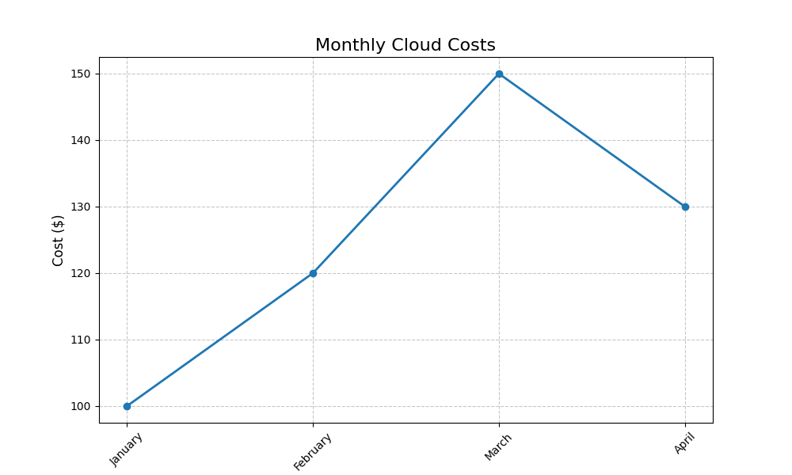

# LangChain Do it!

### langhchain_chart.py

목표: *Retrieval-Augmented Generation (RAG)* 의 워크플로에 "차트 그리기" 기능을 통합  
- 이를 위해 RAG 파이프라인에 차트 생성기(예: Matplotlib 또는 Plotly)를 도구로 추가  
  (LangChain에서는 Tools를 사용하여 외부 함수를 등록할 수 있으므로, "차트를 그리는 도구"를 하나의 도구로 등록하고 이를 LLM이 사용할 수 있게 설정하면 됨)

<pre>
input_data = {
    'months': ['January', 'February', 'March', 'April'],
    'costs': [100.0, 120.0, 150.0, 130.0]
}
</pre>

이 데이터를 이용해서 아래와 같이 수행하면

<pre>
json_input_data = json.dumps(input_data)
response = agent.run(f"다음 데이터를 이용해 차트를 생성하세요: {json_input_data}")
</pre>

다음 그림처럼 차트 이미지가 생성되는 샘플 코드

